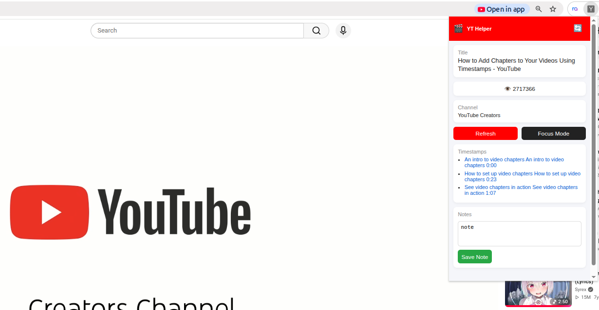
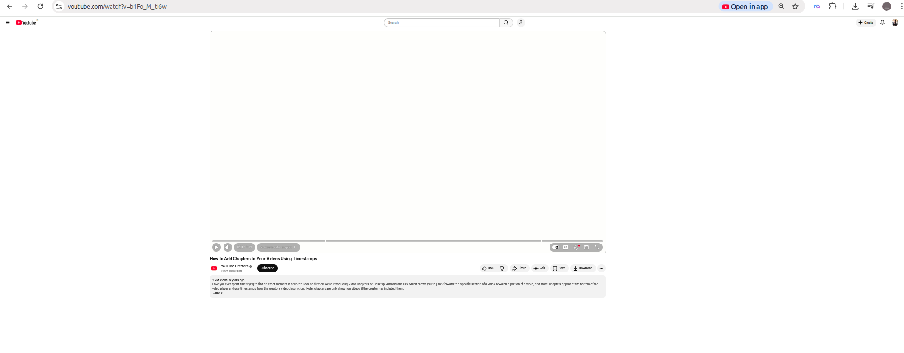

 
---

# YT Helper – **Turn YouTube Into a Productivity Machine** 🎯📺

### **Overview** 🚀

YT Helper is a Chrome Extension built with pure Vanilla JavaScript to make YouTube… less distracting and more useful.

No frameworks.
No bloat.
Just you, the DOM, and a mission to actually learn something on YouTube.

With YT Helper, you can:

* Extract video insights instantly
* Jump through timestamps like a pro
* Enter Focus Mode (goodbye distractions 👋)
* Save personal notes per video
* Keep everything stored locally (because memory matters)

---

### **How It Works** 💻

1. **Fetch Video Insights**
   Click the main button and instantly get:

   * Video title
   * Channel name
   * View count
     All pulled directly from the YouTube page like a stealthy ninja.

2. **Smart Timestamps**
   The extension scans the video description and extracts timestamps.

   Click → Jump → Learn faster.

3. **Focus Mode**
   One click and boom:

   * Sidebar = gone
   * Comments = gone

   Just you and the content. No rabbit holes allowed.

4. **Notes System**
   Write notes for each video.

   They are saved using `chrome.storage.local`, so:

   * Refresh safe ✅
   * Video-specific ✅
   * No login required ✅

---

### **Technologies Used** 🔧

* HTML5
* CSS3
* Vanilla JavaScript
* Chrome Extension APIs
* DOM Manipulation
* chrome.storage API

No build tools. No bundlers. No drama.

---

### **Key Features** 🎉

* 🎥 Extract video metadata (title, channel, views)
* ⏱ Auto-detect timestamps from description
* 🔗 Clickable timestamp navigation
* 🧠 Focus Mode (hide sidebar + comments)
* 📝 Persistent notes per video
* 🔄 Refresh insights on demand
* ⚡ Works with YouTube SPA navigation

---


### **Screenshots**




---

### **Demo Video** 🎥

[https://youtu.be/MhL3YuogQ4A?si=Okko6G7K75kDXMtJ]()

---

### **Project Structure** 📂

```bash
yt-extension/
│
├── manifest.json
│
├── content/
│   └── content.js
│
└── popup/
    ├── popup.html
    ├── popup.js
```

Simple. Clean. No nonsense.

---

### **Architecture Overview** 🧠

**manifest.json**
The brain of the extension. Defines permissions, scripts, and behavior.

**content.js**
Runs inside YouTube pages.

* Extracts video data
* Detects timestamps
* Controls Focus Mode
* Handles storage

**popup.js**
Handles UI logic inside the extension popup.

* Fetches data from content script
* Updates UI
* Saves & retrieves notes

**popup.html**
The face of your extension.
Where users click buttons and feel productive.

---

### **Data Flow Overview** 🔄

```text
YouTube Page
   ↓
content.js (extracts data)
   ↓
chrome.runtime messaging
   ↓
popup.js (renders UI)
   ↓
chrome.storage.local (notes saved here)
```

Smooth. Efficient. No unnecessary layers.

---

### **Getting Started** 🚀

1. Clone the repository

```bash
git clone <your-repo-url>
cd yt-extension
```

2. Open Chrome and go to:

```text
chrome://extensions/
```

3. Enable:

```
Developer Mode (top right)
```

4. Click:

```
Load Unpacked
```

5. Select your project folder

Done. Your extension is now live 🎉

---

### **Important Notes ⚠️**

* Works only on:

```
https://www.youtube.com/*
```

* Uses YouTube’s DOM structure — if YouTube changes UI, things might break (they love doing that)

* Make sure your popup file is correctly named:

```
popup.html (NOT poup.html 👀)
```

---

### **Learning Goals** 🎯

This project demonstrates:

* Chrome Extension (Manifest V3)
* Message passing between scripts
* DOM scraping techniques
* Handling SPA navigation (MutationObserver)
* Local storage management
* Clean modular JavaScript

Proof that you can build useful tools without frameworks.

---

### **Final Thoughts** 🧠

YT Helper turns passive watching into active learning.

It helps you:

* Stay focused
* Capture ideas
* Navigate content faster

Because YouTube shouldn’t just take your time…

It should give you value back.

---

## **License**

MIT License — do whatever you want, just don’t blame me if you get too productive 😄

This project is licensed under the MIT License - see the [LICENSE](./LICENSE) file for details.


---

# Stay Focused. Stay Curious. 🚀
